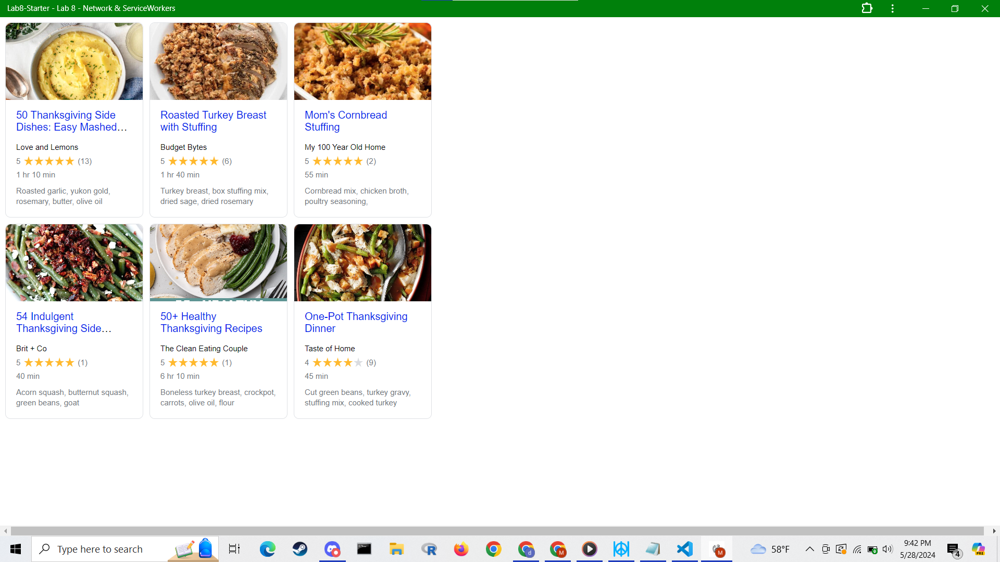

# Lab8-Starter

Maasilan Kumaraguru \

Webpage Link: https://kmaasilan.github.io/Lab8-Starter/ \

Graceful degradation and service workers are related because service workers helps enable graceful degradation for web apps. 
Since service workers allows web apps to work offline, people without a stable internet connection can still use the web app. 
Without service workers, an internet connection would be required for the web app to operate and those without a stable internet 
connection would be out of luck. Hence, service workers enables graceful degradation as the web app adapts to limitations such as a poor  
internet connection instead of failing completely. \

pwa.png \
